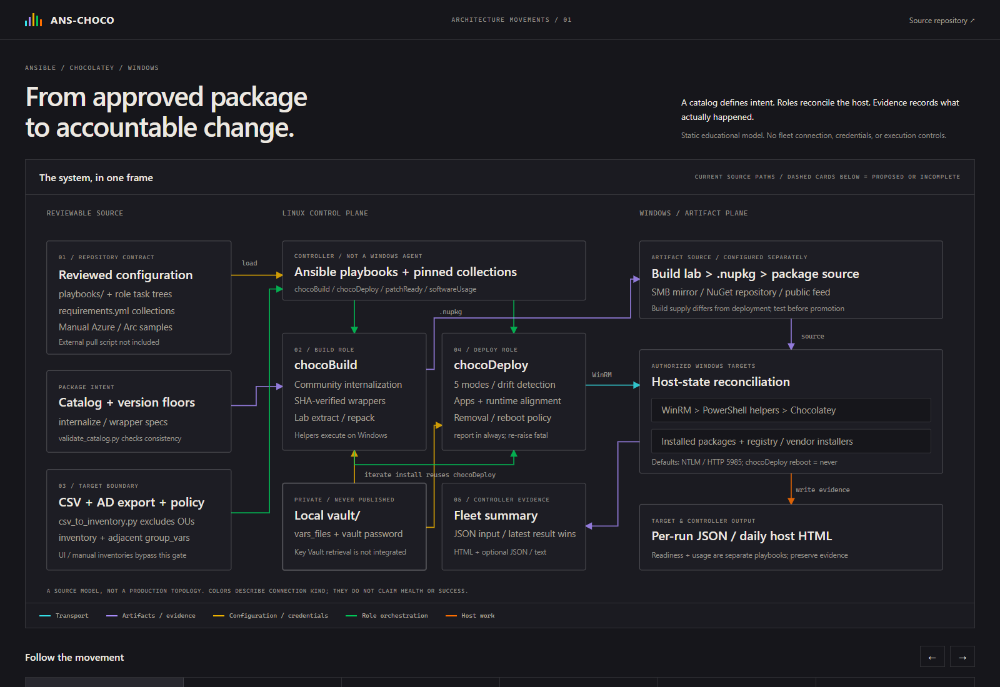
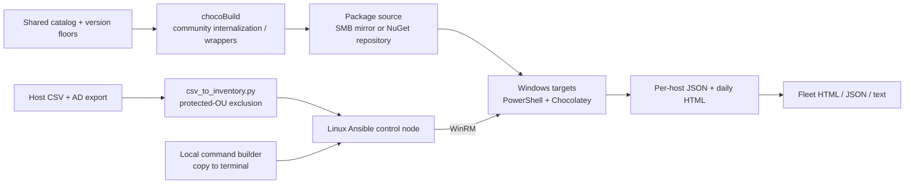

# ANS-CHOCO

**Windows software alignment with Ansible, Chocolatey, and per-host evidence.**
A portfolio project by [David Kurtz](https://github.com/djaykurtz).

[Architecture showcase](https://djaykurtz.github.io/ANS-CHOCO/) - a static,
code-grounded diagram with a five-stage walkthrough. It connects no live systems.



The showcase also opens locally from `docs/index.html`. Its optional Pages
workflow deploys only `docs/`; choose **GitHub Actions** as the repository's
Pages source before running it. No cloud or fleet credential is needed.

Windows software can be installed by vendor installers, Chocolatey, or individual
users. ANS-CHOCO separates package preparation from fleet deployment, reconciles
those installation states against approved version floors, and produces reports
that distinguish changes, failures, retries, and reboot advisories.

## Architecture



The runtime is Ansible on Linux controlling Windows through WinRM. PowerShell
helpers handle registry discovery, vendor cleanup, packaging, and reboot state.
Python tools create inventories and aggregate evidence. An optional Azure DevOps
pipeline can use Azure Arc Run Command to update a separately managed control-node
checkout; the external pull script and cloud infrastructure are not included.

## Delivered pipeline scope

| Surface | Behavior |
| --- | --- |
| `chocoDeploy` | Five modes: vendor conversion, managed-package update, baseline installation, explicitly selected installation, and report rebuild. The catalog contains 13 managed applications. |
| Runtime policy | Python, .NET runtime, .NET Framework, and PowerShell Core alignment, with track/floor policy and optional cleanup controls. |
| `chocoBuild` | Community-package internalization, checksum-verified wrapper builds, and extract/repack/install iteration on a test host. |
| Target preparation | CSV deduplication, AD protected-OU exclusion, optional DNS/WinRM probes, and adjacent connection variables. |
| Reporting | Pre-patch readiness HTML, per-run deployment JSON, daily host HTML, fleet roll-ups, interrupted-run evidence collection, and a live log watcher. |
| `softwareUsage` | Reads Security event 4688 and reports `used_recently`, `unused_in_window`, or `audit_off`; command-line and user detail can be sensitive. |
| `webui` | Local command assembly, inventory browsing/export/save, and optional `win_ping`. It does not execute deployment playbooks. |

The delivered pipeline centers on package preparation, policy-driven target
selection, Windows software reconciliation, and reviewable reporting. Its build
and deployment roles have separate responsibilities, while on-target iteration
reuses the deployment engine. Catalogs, inventories, connection variables, and
package sources make the configuration adaptable to another authorized environment.
The current execution path is Ansible/WinRM with file-based vault credentials.
See [configuration guidance](CONFIGURE.md), the [build-role reference](playbooks/roles/chocoBuild/README.md),
and [technical roadmap](docs/FUTURE_BUILDS.md) for setup requirements and optional
extension scope.

## Quickstart: local command-builder demo

No Windows targets, cloud account, credentials, or Ansible installation are needed
to browse the UI and assemble commands. Use Python 3.10+; the Linux launch script
and operational runbooks use `python3.12`. Start from this directory:

```powershell
# Windows: an empty, local campaign store prevents access to operational data.
$env:CHOCO_FLEET_CAMPAIGN_STORE = Join-Path $PWD ".demo\incoming"
python webui\app.py --port 5050
```

```bash
# Linux / macOS: UI preview only; Ansible execution requires Linux.
export CHOCO_FLEET_CAMPAIGN_STORE="$PWD/.demo/incoming"
python3 webui/app.py --port 5050
```

Open <http://127.0.0.1:5050/>. Choose a TEST inventory, select a mode and software,
and inspect the generated command. The inventories use example hosts, so do not
ping or execute them. A yellow health indicator is expected without Ansible and a
vault key. Stop with Ctrl+C. Keep the server bound to loopback; its `--bind` option
can expose the inventory and ping endpoints if changed.

The UI catalog is hand-maintained and includes runtime-version differences from
the role defaults. Reconcile it with the approved floors before copying commands
for a live lab run; the offline preview is an interface demonstration.

## Quickstart: offline report

[examples/reports/](examples/reports/README.md) contains **synthetic**, explicitly
labeled JSON inputs, not deployment results. Generate a report without contacting
any target (Python standard library only):

```powershell
python playbooks\roles\chocoDeploy\files\fleet_summary.py `
  --json-dir examples\reports `
  --output-dir .demo\reports `
  --since 20260101T000000Z --until 20260101T235959Z `
  --short-names --include-json --include-text
```

On Linux, use `python3` and forward slashes for the same paths. Open the generated
`*_chocoDeploy_fleet_summary.html` in a browser. The two inputs represent a failed
attempt followed by a successful retry on **one fictitious host**. Summary counts
describe that fixture only, not project impact. Do not use `--today` for these
fixed-date inputs, or `--archive`, which moves and deletes consumed inputs.

## Checks and optional CI

The existing Python suite covers inventory exclusion/evidence, scope validation,
catalog floors, report discovery, and live-log parsing. PyYAML is its only extra
dependency:

```powershell
python -m venv .venv
.\.venv\Scripts\python.exe -m pip install -r requirements-dev.txt
.\.venv\Scripts\python.exe -m unittest discover -s playbooks\tools\tests -p "test_*.py"
.\.venv\Scripts\python.exe playbooks\tools\validate_catalog.py
```

On Linux, use `python3.12 -m venv .venv` and `.venv/bin/python`. The catalog
validator can pass with warnings: its current mirror/version declarations do not
cover every approved floor. It does not query a live feed or repository.
The GitHub Actions workflow runs these offline checks only. Azure DevOps
promotion/deploy samples are manual and require explicit environment setup.

## Running against your own lab

This is not a turn-key Windows installer. Use an isolated Linux control node and
Windows lab targets with authorized administrator credentials and a reachable
WinRM listener. Follow [CONFIGURE.md](CONFIGURE.md) for collections, vaults,
inventory, package-source, and optional pipeline settings.

After setup, start with a single lab host and a connectivity check. A narrow
software-changing run has this shape:

```bash
ansible-playbook playbooks/chocoDeploy.yml \
  -i inventory/TEST/inv-TEST-solo.yml \
  --vault-password-file=vault/.vault_key.txt \
  -l test-host-01.corp.example.com \
  -e "deployment=choco_selective" \
  -e '{"targetSoftware":["7zip.install"],"removeSoftware":[],"targetRuntimes":[]}' \
  -e "choco_deploy_reboot=never" \
  -e "choco_ignore_checksums=false"
```

The target name above must be replaced with your lab host. Version floors are
configuration, not a promise that those packages are currently available.
`report_only` rebuilds daily HTML from existing target JSON; it is **not** a fresh
inventory scan or a dry run of deployment. `patchReady` changes no software but
archives older target reports. See the [demo walkthrough](docs/ans-choco-demo/Demo_Walkthrough.md)
and [reporting reference](docs/reporting/Reporting_QuickRef.md).

## Design tradeoffs and operational safety

The build/deploy split keeps vendor-download and package-rewriting logic out of
routine fleet runs. Approved floors, a shared catalog, and validation support
reviewable promotion; they still require testing on a lab host before deployment.
The UI deliberately leaves playbook execution in a streaming terminal, but its
inventory-save and ping actions have real side effects.

Registry and Chocolatey state can disagree. Reconciliation and cleanup handle
that drift, but vendor conversion can remove software before its replacement
installs. Narrow targets, explicit removals, recovery evidence, and a maintenance
window remain operator responsibilities. Fatal role errors are reported and
re-raised; a successful exit code is not a substitute for reading host evidence.

Reboots default to `never` in `chocoDeploy`. Protected-OU exclusion happens only
when `csv_to_inventory.py` creates an inventory; hand-authored inventories and UI
saves bypass it. Unknown hosts are warned about, not excluded. The example
transport is HTTP/5985 with NTLM; review transport, firewall, and identity policy
before real use. `choco_ignore_checksums` defaults to `true` in the inherited
configuration; the example above explicitly disables it. NXLog's example also
permits untrusted HTTPS certificates and requires environment review.

Keep credentials in the ignored `vault/`, not `vault.example/`. Use an encrypted
vault and least-privilege identities. Reports may include usernames, command
lines, inventory paths, and host details; keep operational output outside source
control and review it before sharing.

## Explore the code

[Documentation index](docs/index.md) | [Deployment guide](docs/deploy/chocoDeploy_Guide.md)
| [Package-building guide](docs/build/chocoBuild_Guide.md)
| [Web UI](webui/README.md) | [Tooling reference](_requirements/TOOLING_VERSIONS.md)

No repository-wide license is supplied. Existing role metadata license
declarations are retained; publication of this portfolio does not grant a new
license to reuse the code.
