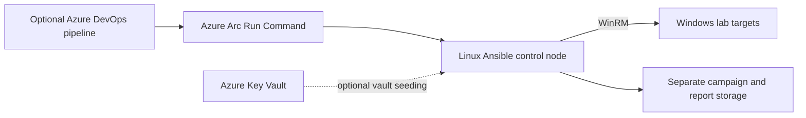

# Environment access and hosting reference

This is an example deployment pattern, not an address book or access grant.
Start with [CONFIGURE.md](../../CONFIGURE.md) for your own lab. Included host,
account, domain, cloud-resource, and IP values are nonfunctional examples.

## Hosting model

Ansible runs from the project checkout on a Linux node. For an automated
deployment, the node may expose a pipeline-managed checkout that operators read
but do not edit. The Arc sample invokes an **external** pull script; provisioning,
checkout ownership, branch policy, identity permissions, and network access are
environment responsibilities, not features supplied by this repository.

## Storage and authorization

| Surface | Contract |
| --- | --- |
| Checkout | Contains playbooks and tools; optional deploy-managed path `/opt/ansible/repos/choco-fleet` |
| Runtime data | `$CHOCO_FLEET_DATA_ROOT`, default `/opt/ansible`; campaign data under `incoming/`, reports under `LOGS/` |
| WinRM vars | Each inventory has adjacent `group_vars/basic_hosts.yml` |
| File vault | `<checkout>/vault/`, ignored by source control, with restricted ownership and permissions |
| Operator access | Individual accounts with only the required checkout/data permissions |
| Cloud identity | Optional managed identity with narrowly scoped secret and Run Command access |

Do not place vault material in shared campaign or log directories. With Linux
ACLs, grant only explicitly authorized operators access to the private vault.
Never publish operational CSVs, inventories, AD exports, process command lines,
or host reports.

## Credentials

Fleet playbooks load `vault/corp-ans-secret.yml` through `vars_files`, which
defines `ansible_user` and `ansible_password`. A normal playbook call needs
`--vault-password-file=vault/.vault_key.txt`; ad-hoc Ansible additionally needs
`-e @vault/corp-ans-secret.yml` because it does not load playbook vars.

The domain-join helpers require local connection credentials (`sys_adm`,
`sys_adm_pass`) and domain credentials (`dom_adm`, `dom_adm_pass`). Nexus uploads
use `vault/.nexus_api_key`. None of the example credentials grants access.

`misc/Seed-VaultFromKeyVault.ps1` and `misc/Nexus-ApiKey-Seed.ps1` illustrate
reading authorized Key Vault secrets and delivering them through SSH stdin to a
chosen checkout. They write private files and backups, so review every parameter
and target before running them. The optional `getAzKVSecret` role retrieves a
secret through `pwsh` and Az modules; it is not wired into fleet playbooks.

## Connection and deployment review

The example inventories use HTTP/5985 with NTLM. Review listener configuration,
firewall scope, administrator privileges, encryption/transport policy, and
credential lifetime for your environment. Do not weaken a firewall or disable
certificate checks merely to match an example.

Azure DevOps promotion and deployment examples have no automatic trigger.
Configure the service connection, Arc node, resource group, external pull script,
and pinned collections deliberately before opting into deployment. Keep a
deployment-managed checkout clean; make software/configuration changes through
the chosen review process rather than editing it on the node.

## Operational reports

See [Reporting_QuickRef.md](../reporting/Reporting_QuickRef.md) for collection and
roll-up commands. Preserve the original per-host evidence after interrupted
runs. `fleet_summary.py --archive` moves consumed JSON into an archive and prunes
older archives, so use it only after deciding the retention policy. A roll-up's
host count is a coverage check, not proof that every intended target was reached.
